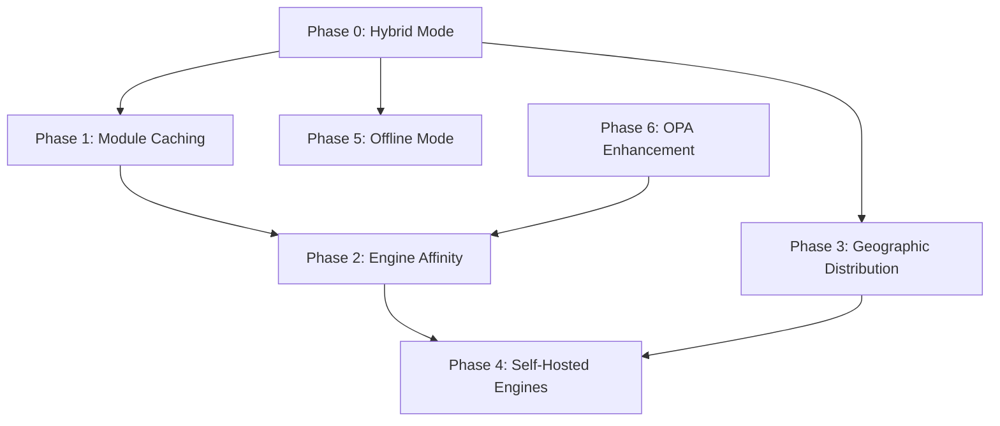

# Engine Service Implementation Tasks

This document provides a detailed task breakdown for implementing the Engine Service features based on the resolved Open Questions in [engine-service-spec.md](./engine-service-spec.md).

## Overview

| Feature | Priority | Complexity | Dependencies |
|---------|----------|------------|--------------|
| **Hybrid Execution Mode** | **Critical** | Medium | None |
| Module Caching | High | Medium | Hybrid Mode |
| Engine Affinity | High | Medium | Module Caching |
| Geographic Distribution | Medium | High | Hybrid Mode |
| Self-Hosted Engines | Medium | High | Engine Affinity |
| Offline Mode | Low | Low | Hybrid Mode |

---

## Phase 0: Hybrid Execution Mode

**Goal**: Support local, cloud, and hybrid Dagger execution so developers can run simple workflows locally without requiring the Engine Service.

### Why This Comes First

The Engine Service is designed for managed, multi-tenant cloud execution. But many use cases don't need it:

| Scenario | Engine Mode | Why |
|----------|-------------|-----|
| Local development | `local` | Fast iteration, no network dependency |
| CI/CD with self-hosted runner | `local` | Runner has Dagger installed |
| Production workflows | `cloud` | Managed scaling, billing, security |
| Resource-intensive jobs | `cloud` | GPU, high memory, specialized hardware |
| Mixed workflows | `auto` | Simple steps local, heavy steps cloud |

### Task 0.1: Define Engine Mode Configuration

**Estimated Effort**: 1 day

**File**: `cb-core/src/workflow.rs`

- [ ] Add `EngineMode` enum to workflow and transition configuration
- [ ] Define mode selection criteria (resource requirements, explicit config)
- [ ] Document mode precedence rules

```rust
/// How to provision Dagger engines for execution.
#[derive(Debug, Clone, Serialize, Deserialize, Default, PartialEq)]
#[serde(rename_all = "snake_case")]
pub enum EngineMode {
    /// Use local Dagger installation (Docker/Podman).
    /// Fastest for development, no network required.
    Local,
    
    /// Use Circuit Breaker Engine Service.
    /// Required for: GPU, high memory, managed billing, multi-tenant isolation.
    Cloud,
    
    /// Automatically select based on requirements and availability.
    /// Prefers local, falls back to cloud for resource-intensive jobs.
    #[default]
    Auto,
}

/// Engine requirements that influence mode selection in Auto mode.
#[derive(Debug, Clone, Serialize, Deserialize, Default, PartialEq)]
pub struct EngineRequirements {
    /// Require GPU access (forces cloud mode).
    #[serde(default)]
    pub gpu: bool,
    
    /// Minimum memory in GB (>16GB suggests cloud mode).
    #[serde(default)]
    pub memory_gb: Option<u32>,
    
    /// Minimum CPU cores (>8 suggests cloud mode).
    #[serde(default)]
    pub cpu_cores: Option<u32>,
    
    /// Require specific Dagger version.
    #[serde(default)]
    pub engine_version: Option<String>,
    
    /// Force cloud for billing/audit trail.
    #[serde(default)]
    pub require_audit: bool,
}
```

**Workflow YAML Example**:
```yaml
name: build-and-test
engine:
  mode: auto  # or: local, cloud
  requirements:
    memory_gb: 8
    
transitions:
  - name: unit-tests
    action:
      dagger:
        module: "github.com/myorg/ci"
        function: "test"
    # Inherits workflow engine mode
    
  - name: integration-tests
    engine:
      mode: cloud  # Override: needs more resources
      requirements:
        memory_gb: 32
        gpu: true
    action:
      dagger:
        module: "github.com/myorg/ci"
        function: "integration_test"
```

**Acceptance Criteria**:
- `EngineMode` enum added to workflow schema
- Per-transition override supported
- Schema validated with JSON Schema / serde

### Task 0.2: Implement Local Engine Executor

**Estimated Effort**: 2 days

**File**: `cb-runner/src/engine/local.rs`

- [ ] Create `LocalEngine` that uses local Dagger CLI/SDK
- [ ] Detect Dagger installation and version
- [ ] Support Docker and Podman runtimes
- [ ] Handle missing Dagger with helpful error messages

```rust
pub struct LocalEngine {
    dagger_path: PathBuf,
    runtime: ContainerRuntime,
}

#[derive(Debug, Clone)]
pub enum ContainerRuntime {
    Docker,
    Podman,
    Colima,
}

impl LocalEngine {
    /// Detect local Dagger installation.
    pub async fn detect() -> Result<Option<Self>> {
        // Check for dagger in PATH
        // Verify container runtime is running
        // Return None if not available
    }
    
    /// Execute a Dagger module function locally.
    pub async fn execute(
        &self,
        module: &str,
        function: &str,
        args: &serde_json::Value,
    ) -> Result<ExecutionResult> {
        // Use dagger_sdk::connect() with local engine
        // No mTLS, no Engine Service
    }
}
```

**Acceptance Criteria**:
- Local execution works without Engine Service
- Clear error if Dagger not installed
- Docker and Podman both supported

### Task 0.3: Implement Cloud Engine Executor

**Estimated Effort**: 1 day

**File**: `cb-runner/src/engine/cloud.rs`

- [ ] Extract existing Engine Service client into `CloudEngine`
- [ ] Add connection pooling and retry logic
- [ ] Implement health checking

```rust
pub struct CloudEngine {
    client: EngineServiceClient,
    config: CloudEngineConfig,
}

pub struct CloudEngineConfig {
    pub service_url: String,
    pub api_key: String,
    pub organization_id: String,
    pub connect_timeout: Duration,
    pub request_timeout: Duration,
}

impl CloudEngine {
    pub async fn execute(
        &self,
        module: &str,
        function: &str,
        args: &serde_json::Value,
        requirements: &EngineRequirements,
    ) -> Result<ExecutionResult> {
        // Request engine from service
        // Establish mTLS connection
        // Execute via GraphQL
    }
}
```

**Acceptance Criteria**:
- Existing Engine Service integration refactored
- Configurable timeouts and retries
- Proper error propagation

### Task 0.4: Implement Auto Mode Selection

**Estimated Effort**: 2 days

**File**: `cb-runner/src/engine/selector.rs`

- [ ] Create `EngineSelector` that chooses between local and cloud
- [ ] Implement requirement-based selection logic
- [ ] Add fallback behavior when preferred mode unavailable

```rust
pub struct EngineSelector {
    local: Option<LocalEngine>,
    cloud: Option<CloudEngine>,
    config: SelectorConfig,
}

pub struct SelectorConfig {
    /// Threshold for preferring cloud (memory GB).
    pub cloud_memory_threshold: u32,  // default: 16
    /// Threshold for preferring cloud (CPU cores).
    pub cloud_cpu_threshold: u32,     // default: 8
    /// Prefer local even if cloud configured.
    pub prefer_local: bool,           // default: true
    /// Fall back to cloud if local fails.
    pub fallback_to_cloud: bool,      // default: true
}

impl EngineSelector {
    pub async fn select(
        &self,
        mode: EngineMode,
        requirements: &EngineRequirements,
    ) -> Result<SelectedEngine> {
        match mode {
            EngineMode::Local => self.select_local(requirements).await,
            EngineMode::Cloud => self.select_cloud(requirements).await,
            EngineMode::Auto => self.select_auto(requirements).await,
        }
    }
    
    async fn select_auto(&self, req: &EngineRequirements) -> Result<SelectedEngine> {
        // Force cloud if GPU required
        if req.gpu {
            return self.select_cloud(req).await;
        }
        
        // Force cloud if audit required
        if req.require_audit {
            return self.select_cloud(req).await;
        }
        
        // Prefer cloud for resource-intensive jobs
        if req.memory_gb.unwrap_or(0) > self.config.cloud_memory_threshold
            || req.cpu_cores.unwrap_or(0) > self.config.cloud_cpu_threshold
        {
            return self.select_cloud(req).await;
        }
        
        // Try local first
        if let Some(local) = &self.local {
            if local.is_available().await {
                return Ok(SelectedEngine::Local(local.clone()));
            }
        }
        
        // Fall back to cloud
        if self.config.fallback_to_cloud {
            return self.select_cloud(req).await;
        }
        
        Err(EngineError::NoEngineAvailable)
    }
}

pub enum SelectedEngine {
    Local(LocalEngine),
    Cloud(CloudEngine),
}
```

**Acceptance Criteria**:
- Auto mode prefers local for simple workflows
- Resource requirements respected
- Graceful fallback when preferred mode unavailable

### Task 0.5: Update Runner Configuration

**Estimated Effort**: 1 day

**File**: `cb-runner/src/config.rs`

- [ ] Add engine mode configuration to runner config
- [ ] Support environment variable overrides
- [ ] Add CLI flags for mode selection

```toml
# runner.toml

[engine]
# Default mode for all workflows (can be overridden per-workflow)
mode = "auto"  # local, cloud, auto

# Local engine settings
[engine.local]
dagger_path = "/usr/local/bin/dagger"  # optional, auto-detect
runtime = "docker"  # docker, podman, auto

# Cloud engine settings (optional for local-only)
[engine.cloud]
url = "https://engines.circuitbreaker.io"
api_key = "${CB_API_KEY}"
organization_id = "${CB_ORG_ID}"

# Auto mode thresholds
[engine.auto]
prefer_local = true
fallback_to_cloud = true
cloud_memory_threshold_gb = 16
cloud_cpu_threshold_cores = 8
```

**Environment Overrides**:
```bash
# Force local mode
CB_ENGINE_MODE=local cb-runner start

# Force cloud mode
CB_ENGINE_MODE=cloud cb-runner start
```

**Acceptance Criteria**:
- Configuration file supports all modes
- Environment variables override config
- Sensible defaults for local development

### Task 0.6: Integration Testing

**Estimated Effort**: 2 days

- [ ] Test local mode with Docker
- [ ] Test local mode with Podman
- [ ] Test cloud mode with mock Engine Service
- [ ] Test auto mode selection logic
- [ ] Test fallback scenarios

**Test Scenarios**:
```rust
#[tokio::test]
async fn test_local_mode_simple_workflow() {
    // Given: Local Dagger installed, engine mode = local
    // When: Execute simple Dagger function
    // Then: Executes locally without Engine Service call
}

#[tokio::test]
async fn test_auto_mode_prefers_local() {
    // Given: Local Dagger available, no special requirements
    // When: Execute with mode = auto
    // Then: Uses local engine
}

#[tokio::test]
async fn test_auto_mode_uses_cloud_for_gpu() {
    // Given: GPU required
    // When: Execute with mode = auto
    // Then: Uses cloud engine
}

#[tokio::test]
async fn test_fallback_to_cloud_when_local_unavailable() {
    // Given: Local Dagger not installed, cloud configured
    // When: Execute with mode = auto
    // Then: Falls back to cloud
}

#[tokio::test]
async fn test_offline_local_only() {
    // Given: Engine Service unavailable, local available
    // When: Execute with mode = auto, fallback disabled
    // Then: Uses local successfully
}
```

**Acceptance Criteria**:
- All test scenarios pass
- CI runs tests with both Docker and Podman
- Mock Engine Service for cloud tests

---

## Phase 1: Module Caching System

**Goal**: Cache modules in engine instances using container filesystems to speed up repeated executions while ensuring isolation between tenants.

### Task 1.1: Design Module Cache Architecture

**Estimated Effort**: 2 days

- [ ] Define cache key structure: `{org_id}/{module_source_hash}/{version}`
- [ ] Design cache storage layout using container volumes
- [ ] Document isolation boundaries (per-org, per-engine)
- [ ] Define cache eviction policies (LRU, TTL-based, size-based)
- [ ] Create ADR (Architecture Decision Record) for caching strategy

**Acceptance Criteria**:
- Cache key format documented
- Storage layout diagram created
- Eviction policy defined with configurable parameters
- Security review completed for multi-tenant isolation

### Task 1.2: Implement Cache Storage Layer

**Estimated Effort**: 3 days

**File**: `cb-engine-service/src/cache/mod.rs`

- [ ] Create `ModuleCache` trait with async operations
- [ ] Implement `ContainerFsCache` using engine pod volumes
- [ ] Add cache metadata store (Redis/PostgreSQL)
- [ ] Implement cache key generation from module sources
- [ ] Add cache hit/miss metrics

```rust
pub trait ModuleCache: Send + Sync {
    async fn get(&self, key: &CacheKey) -> Result<Option<CachedModule>>;
    async fn put(&self, key: &CacheKey, module: &CachedModule) -> Result<()>;
    async fn invalidate(&self, key: &CacheKey) -> Result<()>;
    async fn stats(&self) -> CacheStats;
}

pub struct CacheKey {
    pub organization_id: String,
    pub module_source: ModuleSource,
    pub module_hash: String,
    pub engine_version: String,
}
```

**Acceptance Criteria**:
- Cache operations complete within 100ms for hits
- Cache correctly isolates between organizations
- Metrics exposed for cache hit rate, size, eviction count

### Task 1.3: Integrate Cache with Engine Provisioning

**Estimated Effort**: 2 days

**File**: `cb-engine-service/src/provisioner.rs`

- [ ] Add cache lookup before module load
- [ ] Mount cached module volumes to engine pods
- [ ] Populate cache after successful module execution
- [ ] Add cache headers to API responses (`X-CB-Cache-Hit: true/false`)

**Acceptance Criteria**:
- Cached module executions 50%+ faster than cold starts
- Cache population happens asynchronously (doesn't block response)
- API response indicates cache status

### Task 1.4: Cache Eviction and Cleanup

**Estimated Effort**: 2 days

- [ ] Implement background cache cleanup job
- [ ] Add per-organization cache quotas
- [ ] Create cache purge API endpoint (`DELETE /v1/cache`)
- [ ] Add cache warming for frequently-used modules

**Acceptance Criteria**:
- Cache never exceeds configured size limits
- Organizations can manually purge their cache
- Stale cache entries removed within TTL window

---

## Phase 2: Engine Affinity

**Goal**: Route requests for the same module to the same engine to maximize cache effectiveness and reduce cold starts.

### Task 2.1: Design Affinity Routing Strategy

**Estimated Effort**: 1 day

- [ ] Define affinity key: `{org_id}:{module_source_hash}`
- [ ] Document affinity timeout (how long to prefer same engine)
- [ ] Design fallback behavior when preferred engine unavailable
- [ ] Consider affinity vs load balancing tradeoffs

**Affinity Algorithm**:
```
1. Compute affinity_key = hash(org_id, module_source)
2. Check affinity_map for existing engine assignment
3. If engine exists and is healthy:
   - Route to existing engine
   - Update last_used timestamp
4. Else:
   - Select engine from pool (prefer engines with cached module)
   - Store affinity_key -> engine_id mapping
   - Set TTL (default: 30 minutes)
```

### Task 2.2: Implement Affinity Map Store

**Estimated Effort**: 2 days

**File**: `cb-engine-service/src/affinity/mod.rs`

- [ ] Create `AffinityStore` backed by Redis
- [ ] Implement consistent hashing for engine selection
- [ ] Add affinity override for load balancing scenarios
- [ ] Track affinity hit rate metrics

```rust
pub struct AffinityStore {
    redis: RedisPool,
    ttl: Duration,
}

impl AffinityStore {
    pub async fn get_preferred_engine(
        &self,
        org_id: &str,
        module_source: &ModuleSource,
    ) -> Option<EngineId>;
    
    pub async fn set_affinity(
        &self,
        org_id: &str,
        module_source: &ModuleSource,
        engine_id: &EngineId,
    ) -> Result<()>;
    
    pub async fn clear_affinity(&self, engine_id: &EngineId) -> Result<()>;
}
```

**Acceptance Criteria**:
- Affinity lookups complete within 5ms (p99)
- Affinity persists across service restarts
- Graceful degradation if Redis unavailable

### Task 2.3: Integrate Affinity with Request Router

**Estimated Effort**: 2 days

**File**: `cb-engine-service/src/router.rs`

- [ ] Add affinity lookup to `POST /v1/engines` handler
- [ ] Implement engine selection with affinity preference
- [ ] Add `X-CB-Engine-Affinity: hit/miss` response header
- [ ] Update engine selection to consider cache state

**Acceptance Criteria**:
- 80%+ affinity hit rate for repeated module executions
- No increase in request latency (< 10ms overhead)
- Load remains balanced when affinity misses

### Task 2.4: Affinity-Aware Pool Management

**Estimated Effort**: 2 days

- [ ] Prefer keeping engines with high affinity hits warm
- [ ] Add affinity score to engine lifecycle decisions
- [ ] Clear affinity mappings when engines terminate
- [ ] Implement affinity rebalancing for hot engines

**Acceptance Criteria**:
- High-affinity engines kept warm longer
- No single engine becomes a bottleneck
- Affinity cleared promptly on engine termination

---

## Phase 3: Geographic Distribution

**Goal**: Ensure engines run in the same region as the engine service to minimize latency.

### Task 3.1: Multi-Region Architecture Design

**Estimated Effort**: 2 days

- [ ] Define supported regions (us-east-1, us-west-2, eu-west-1, etc.)
- [ ] Design region-local engine service deployment
- [ ] Document cross-region considerations (data residency, latency)
- [ ] Create region routing strategy

**Architecture**:
```
┌─────────────────────────────────────────────────────────────────┐
│                     Global Load Balancer                         │
│                  engines.circuitbreaker.io                       │
└────────────────────────┬────────────────────────────────────────┘
                         │ GeoDNS / Anycast
         ┌───────────────┼───────────────┐
         ▼               ▼               ▼
┌─────────────┐  ┌─────────────┐  ┌─────────────┐
│  us-east-1  │  │  us-west-2  │  │  eu-west-1  │
│             │  │             │  │             │
│ ┌─────────┐ │  │ ┌─────────┐ │  │ ┌─────────┐ │
│ │ Engine  │ │  │ │ Engine  │ │  │ │ Engine  │ │
│ │ Service │ │  │ │ Service │ │  │ │ Service │ │
│ └────┬────┘ │  │ └────┬────┘ │  │ └────┬────┘ │
│      │      │  │      │      │  │      │      │
│ ┌────▼────┐ │  │ ┌────▼────┐ │  │ ┌────▼────┐ │
│ │  K8s    │ │  │ │  K8s    │ │  │ │  K8s    │ │
│ │ Cluster │ │  │ │ Cluster │ │  │ │ Cluster │ │
│ └─────────┘ │  │ └─────────┘ │  │ └─────────┘ │
└─────────────┘  └─────────────┘  └─────────────┘
```

### Task 3.2: Region-Aware API Gateway

**Estimated Effort**: 3 days

- [ ] Implement GeoDNS routing to nearest region
- [ ] Add `X-CB-Region` header to indicate serving region
- [ ] Add `?region=` query parameter for explicit region selection
- [ ] Implement region failover for outages

**API Changes**:
```http
POST /v1/engines?region=us-west-2
X-CB-Organization: org-123

Response Headers:
X-CB-Region: us-west-2
X-CB-Region-Latency: 12ms
```

**Acceptance Criteria**:
- Requests routed to nearest region by default
- Region override honored when specified
- Automatic failover within 30 seconds of region failure

### Task 3.3: Cross-Region Data Sync

**Estimated Effort**: 3 days

- [ ] Sync organization quotas across regions
- [ ] Replicate API keys and authentication data
- [ ] Implement eventually-consistent usage tracking
- [ ] Add region-specific cache (no cross-region cache sharing)

**Acceptance Criteria**:
- Organization data consistent within 5 seconds
- Each region operates independently for cache
- Billing accurately reflects cross-region usage

### Task 3.4: Region Health and Observability

**Estimated Effort**: 2 days

- [ ] Add per-region health endpoints
- [ ] Implement region capacity metrics
- [ ] Create cross-region dashboard
- [ ] Add region-specific alerting

**Acceptance Criteria**:
- Region health visible from any region
- Alerts fire within 1 minute of region degradation
- Dashboard shows global and per-region metrics

---

## Phase 4: Self-Hosted Engine Registration

**Goal**: Allow organizations to register and use their own Dagger engines.

### Task 4.1: Self-Hosted Engine Design

**Estimated Effort**: 2 days

- [ ] Define registration API and flow
- [ ] Design authentication for self-hosted engines
- [ ] Document network requirements (mTLS, firewall rules)
- [ ] Create security model for self-hosted engines

**Registration Flow**:
```
1. Organization admin generates registration token in UI/API
2. Admin deploys engine with token: CB_ENGINE_TOKEN=xxx
3. Engine calls POST /v1/engines/register on startup
4. Engine Service validates token, issues mTLS cert
5. Engine establishes persistent connection (heartbeat)
6. Engine appears in organization's engine pool
```

### Task 4.2: Engine Registration API

**Estimated Effort**: 3 days

**Endpoints**:
```http
# Generate registration token (admin)
POST /v1/organizations/{org_id}/engine-tokens
{
  "name": "on-prem-engine-1",
  "allowed_pools": ["high-security"],
  "expires_in_hours": 24
}

Response:
{
  "token": "cbeng_xxx...",
  "expires_at": "2024-01-16T12:00:00Z"
}

# Register engine (engine calls this)
POST /v1/engines/register
{
  "token": "cbeng_xxx...",
  "engine_version": "v0.18.0",
  "capabilities": {
    "gpu": false,
    "memory_gb": 32,
    "cpu_cores": 8
  },
  "endpoint": "https://engine.corp.example.com:443"
}

Response:
{
  "engine_id": "eng-456",
  "certificate": { ... },
  "heartbeat_interval_seconds": 30
}

# Heartbeat (engine calls periodically)
POST /v1/engines/{engine_id}/heartbeat
{
  "status": "healthy",
  "load": 0.45,
  "active_sessions": 3
}
```

**Acceptance Criteria**:
- Registration tokens expire as configured
- Engine registration validates token and capabilities
- Heartbeat failure marks engine unhealthy within 90 seconds

### Task 4.3: Self-Hosted Engine Selection

**Estimated Effort**: 2 days

- [ ] Add `engine_preference` to engine request API
- [ ] Implement pool-based routing (managed vs self-hosted)
- [ ] Add capability matching (GPU, memory, etc.)
- [ ] Respect organization engine policies

**API Change**:
```http
POST /v1/engines
{
  "module": "github.com/myorg/pipeline",
  "function": "build",
  "engine_preference": {
    "pool": "self-hosted",     // or "managed", "any"
    "capabilities": {
      "gpu": true
    }
  }
}
```

**Acceptance Criteria**:
- Requests honor engine preference
- Fallback to managed engines if self-hosted unavailable
- Capability matching works correctly

### Task 4.4: Self-Hosted Engine Management UI

**Estimated Effort**: 3 days

- [ ] List registered engines with health status
- [ ] Generate/revoke registration tokens
- [ ] View engine utilization and history
- [ ] Configure engine policies (allowed modules, users)

**Acceptance Criteria**:
- All registered engines visible in dashboard
- Token lifecycle manageable through UI
- Real-time health status updates

---

## Phase 5: Offline Mode Handling

**Goal**: Gracefully handle engine service unavailability with clear error messaging.

### Task 5.1: Implement Offline Detection

**Estimated Effort**: 1 day

**File**: `cb-runner/src/engine_client.rs`

- [ ] Add configurable connection timeout
- [ ] Implement circuit breaker for engine service calls
- [ ] Detect network vs service errors

```rust
pub struct EngineClientConfig {
    pub connect_timeout: Duration,      // default: 5s
    pub request_timeout: Duration,      // default: 30s
    pub circuit_breaker: CircuitBreakerConfig,
}

pub struct CircuitBreakerConfig {
    pub failure_threshold: u32,         // default: 5
    pub reset_timeout: Duration,        // default: 30s
}
```

**Acceptance Criteria**:
- Offline detected within configured timeout
- Circuit breaker prevents cascading failures
- Error messages clearly indicate offline state

### Task 5.2: Offline Error Handling

**Estimated Effort**: 1 day

**File**: `cb-runner/src/executor.rs`

- [ ] Return structured error for offline state
- [ ] Include troubleshooting guidance in error
- [ ] Log offline events with context

**Error Response**:
```rust
pub enum EngineError {
    ServiceUnavailable {
        message: String,
        retry_after: Option<Duration>,
        troubleshooting: Vec<String>,
    },
    // ... other variants
}

// Example error:
EngineError::ServiceUnavailable {
    message: "Engine service unavailable",
    retry_after: Some(Duration::from_secs(30)),
    troubleshooting: vec![
        "Check network connectivity to engines.circuitbreaker.io",
        "Verify API key is valid and not expired",
        "Check https://status.circuitbreaker.io for outages",
    ],
}
```

**Acceptance Criteria**:
- Clear, actionable error messages
- Retry-After header respected when present
- Troubleshooting steps included in error

### Task 5.3: Future - Local Fallback Mode (Deferred)

**Note**: This is documented for future implementation but not in current scope.

- [ ] Cache engine connection details locally
- [ ] Implement local Dagger engine fallback
- [ ] Define which operations work offline
- [ ] Sync results when connectivity restored

---

## Phase 6: OPA Policy Service Enhancement

**Goal**: Centralize policy evaluation for improved performance and consistency.

### Task 6.1: Evaluate OPA Deployment Options

**Estimated Effort**: 1 day

| Option | Pros | Cons |
|--------|------|------|
| Conftest per execution (current) | Simple, isolated | Cold start per eval, no caching |
| OPA sidecar per engine | Low latency, bundle caching | More pods, memory overhead |
| Centralized OPA service | Shared cache, easier updates | Network hop, single point of failure |

**Recommendation**: OPA sidecar per engine pod for optimal balance.

### Task 6.2: Implement OPA Sidecar

**Estimated Effort**: 3 days

**File**: `cb-engine-service/k8s/engine-pod.yaml`

```yaml
containers:
  - name: dagger-engine
    image: registry.dagger.io/engine:v0.18.0
    # ... existing config
    
  - name: opa
    image: openpolicyagent/opa:latest
    args:
      - "run"
      - "--server"
      - "--addr=127.0.0.1:8181"
      - "--bundle=/policies"
    volumeMounts:
      - name: policies
        mountPath: /policies
    resources:
      requests:
        memory: "64Mi"
        cpu: "100m"
      limits:
        memory: "128Mi"
        cpu: "200m"

volumes:
  - name: policies
    configMap:
      name: org-policies-{{ .OrgId }}
```

**Acceptance Criteria**:
- OPA sidecar starts with engine pod
- Policy bundles loaded from organization config
- Policy evaluation < 10ms (p99)

### Task 6.3: Policy Bundle Management

**Estimated Effort**: 2 days

- [ ] Create policy bundle storage (S3/GCS)
- [ ] Implement bundle versioning
- [ ] Add bundle sync to OPA sidecars
- [ ] Create policy update API

**API**:
```http
# Upload policy bundle
PUT /v1/organizations/{org_id}/policies
Content-Type: application/gzip

# Get current policy version
GET /v1/organizations/{org_id}/policies
{
  "version": "v3",
  "updated_at": "2024-01-15T10:00:00Z",
  "policies": ["main.rego", "security.rego"]
}
```

**Acceptance Criteria**:
- Policy bundles versioned and auditable
- Bundle updates propagate within 60 seconds
- Rollback to previous version supported

### Task 6.4: Update cb-runner Policy Evaluation

**Estimated Effort**: 2 days

**File**: `cb-runner/src/policy.rs`

- [ ] Replace conftest execution with OPA REST API call
- [ ] Add policy decision caching
- [ ] Implement policy evaluation timeout
- [ ] Add policy metrics (decisions/sec, latency)

```rust
pub struct OpaClient {
    base_url: String,  // http://127.0.0.1:8181
    timeout: Duration,
}

impl OpaClient {
    pub async fn evaluate(
        &self,
        policy: &PolicyGate,
        input: &serde_json::Value,
    ) -> Result<PolicyResult> {
        let response = self.http_client
            .post(&format!("{}/v1/data/{}", self.base_url, policy.query))
            .json(&json!({ "input": input }))
            .timeout(self.timeout)
            .send()
            .await?;
        
        // Parse OPA response...
    }
}
```

**Acceptance Criteria**:
- Policy evaluation latency reduced by 90%
- Conftest container no longer required
- Backward compatible with existing PolicyGate config

---

## Testing Strategy

### Unit Tests

| Component | Test Coverage Target |
|-----------|---------------------|
| LocalEngine | 90% |
| CloudEngine | 90% |
| EngineSelector | 95% |
| ModuleCache | 90% |
| AffinityStore | 90% |
| EngineClient | 85% |
| OpaClient | 90% |

### Integration Tests

- [ ] Local mode with Docker runtime
- [ ] Local mode with Podman runtime
- [ ] Cloud mode with Engine Service
- [ ] Auto mode selection logic
- [ ] Fallback from local to cloud
- [ ] Cache hit/miss scenarios
- [ ] Affinity routing under load
- [ ] Self-hosted engine registration flow
- [ ] Offline mode behavior
- [ ] Policy evaluation with OPA sidecar

### Load Tests

- [ ] 1000 concurrent engine requests
- [ ] Cache performance with 10K modules
- [ ] Affinity stability with 100 engines
- [ ] Cross-region failover timing

---

## Rollout Plan

### Phase 0: Hybrid Execution Mode (Week 1-2)
- Implement LocalEngine with Docker/Podman support
- Implement EngineSelector with auto mode logic
- Update runner configuration schema
- Release as default for local development
- **Milestone**: Developers can run workflows locally without Engine Service

### Phase 1: Module Caching (Week 3-4)
- Deploy cache infrastructure
- Enable caching for 10% of traffic
- Monitor hit rates and latency
- Expand to 100%

### Phase 2: Engine Affinity (Week 5-6)
- Deploy affinity store
- Enable for single organization (dogfood)
- Validate cache effectiveness improvement
- Roll out to all organizations

### Phase 3: Geographic Distribution (Week 7-10)
- Deploy to us-west-2 (second region)
- Implement cross-region sync
- Validate failover procedures
- Add eu-west-1

### Phase 4: Self-Hosted Engines (Week 11-13)
- Deploy registration API
- Beta program with select customers
- Build management UI
- General availability

### Phase 5: OPA Enhancement (Week 14-15)
- Deploy OPA sidecars
- Migrate from conftest
- Deprecate conftest path

---

## Success Metrics

| Metric | Current | Target |
|--------|---------|--------|
| Local mode startup time | N/A | < 3s |
| Auto mode selection latency | N/A | < 50ms |
| Local execution success rate | N/A | > 99% |
| Module load time (cached) | N/A | < 2s |
| Affinity hit rate | N/A | > 80% |
| Policy evaluation latency | ~3s | < 100ms |
| Self-hosted engine uptime | N/A | > 99.5% |
| Cross-region failover time | N/A | < 30s |

---

## Dependencies



**Critical Path**: Phase 0 → Phase 1 → Phase 2 → Phase 4

Phase 0 (Hybrid Mode) is the foundation that enables:
- Local development without cloud dependency
- Graceful fallback when Engine Service unavailable
- Clear separation between local and cloud execution paths

---

## References

- [Engine Service Specification](./engine-service-spec.md)
- [Event-Driven Architecture](./event-driven-flow.md)
- [OPA Documentation](https://www.openpolicyagent.org/docs/latest/)
- [Dagger Cloud Architecture](https://github.com/dagger/dagger/tree/main/internal/cloud)